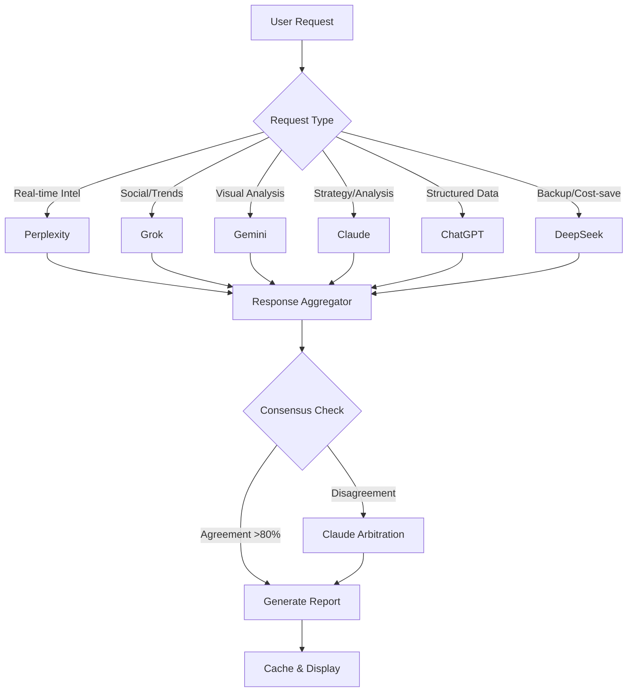

# Store Operations Orchestrator - Complete Build Plan
## Market 396 | Las Vegas Metro Area | 9 Walmart Stores

---

## Table of Contents
1. [Executive Overview](#1-executive-overview)
2. [Market 396 Store Registry](#2-market-396-store-registry)
3. [Premium UI Design System](#3-premium-ui-design-system)
4. [Multi-LLM Intelligence Architecture](#4-multi-llm-intelligence-architecture)
5. [Amazon Warfare Module](#5-amazon-warfare-module)
6. [Technical Architecture](#6-technical-architecture)
7. [Phased Build Plan](#7-phased-build-plan)
8. [Data Models & Schemas](#8-data-models--schemas)
9. [API Integrations](#9-api-integrations)
10. [Testing & Deployment](#10-testing--deployment)
11. [User Feedback Module](#11-user-feedback-module)
12. [Visual Merchandising AI Camera](#12-visual-merchandising-ai-camera)
13. [Ultrathink Enhancements](#13-ultrathink-enhancements)

---

## 1. Executive Overview

### Vision Statement
Build an AI-powered retail intelligence command center that synthesizes competitive intel, local events, weather, traffic, and Amazon threats into actionable morning operations plans for Walmart Market 396's leadership team.

### Core Value Proposition
- **Time Savings**: Reduce morning briefing prep from 2 hours to 15 minutes
- **Intelligence Synthesis**: Aggregate 50+ data sources into unified insights
- **Competitive Advantage**: Real-time Amazon price tracking and response strategies
- **Visual Merchandising**: AI-powered display optimization using computer vision
- **Multi-LLM Consensus**: Cross-validate insights across 6 AI engines

### Target Users
| Role | Primary Use Case |
|------|------------------|
| Market Manager | Daily operations overview, strategic decisions |
| Store Manager | Store-specific action items, staffing |
| Assistant Manager | Department focus, execution tracking |
| Department Managers | Category-specific insights |

### Success Metrics
- Morning briefing prep time < 15 minutes
- 95% report generation success rate
- < 3 second page load times
- 90% user satisfaction score
- Amazon price match response < 4 hours

---

## 2. Market 396 Store Registry

### Complete Store Data
```typescript
const MARKET_396_STORES = [
  {
    storeNumber: 2059,
    name: "Charleston Supercenter",
    format: "Supercenter",
    address: "4505 W Charleston Blvd, Las Vegas, NV 89102",
    coordinates: { lat: 36.1579, lng: -115.1888 },
    phone: "(702) 878-0399",
    sqft: 182000,
    openDate: "1998-03-15",
    departments: ["Grocery", "Electronics", "Home", "Apparel", "Pharmacy", "Vision", "Auto"],
    features: ["Grocery Pickup", "MoneyCenter", "Tire & Lube"],
    tier: "A",
    avgDailyTraffic: 12500,
    peakHours: ["10:00-12:00", "17:00-19:00"],
    competitorProximity: {
      target: 1.2,
      costco: 2.5,
      amazon: { freshHub: 3.1, lockerCount: 2 }
    }
  },
  {
    storeNumber: 3455,
    name: "Craig Road Supercenter",
    format: "Supercenter",
    address: "6464 N Decatur Blvd, Las Vegas, NV 89131",
    coordinates: { lat: 36.2689, lng: -115.2073 },
    phone: "(702) 515-8700",
    sqft: 198000,
    openDate: "2005-07-22",
    departments: ["Grocery", "Electronics", "Home", "Apparel", "Pharmacy", "Garden", "Sporting Goods"],
    features: ["Grocery Pickup", "Grocery Delivery", "Auto Care Center"],
    tier: "A+",
    avgDailyTraffic: 14200,
    peakHours: ["09:00-11:00", "16:00-19:00"],
    competitorProximity: {
      target: 0.8,
      costco: 1.9,
      amazon: { freshHub: 2.8, lockerCount: 3 }
    }
  },
  {
    storeNumber: 5765,
    name: "Tropicana Supercenter",
    format: "Supercenter",
    address: "4350 N Nellis Blvd, Las Vegas, NV 89115",
    coordinates: { lat: 36.2105, lng: -115.0627 },
    phone: "(702) 459-2091",
    sqft: 175000,
    openDate: "2001-11-08",
    departments: ["Grocery", "Electronics", "Home", "Apparel", "Pharmacy"],
    features: ["Grocery Pickup", "MoneyCenter"],
    tier: "B+",
    avgDailyTraffic: 9800,
    peakHours: ["11:00-13:00", "18:00-20:00"],
    competitorProximity: {
      target: 2.1,
      costco: 4.5,
      amazon: { freshHub: null, lockerCount: 1 }
    }
  },
  {
    storeNumber: 4260,
    name: "Blue Diamond Supercenter",
    format: "Supercenter",
    address: "7200 Arroyo Crossing Pkwy, Las Vegas, NV 89113",
    coordinates: { lat: 36.0642, lng: -115.2442 },
    phone: "(702) 365-9600",
    sqft: 205000,
    openDate: "2008-09-12",
    departments: ["Grocery", "Electronics", "Home", "Apparel", "Pharmacy", "Vision", "Garden", "Sporting Goods"],
    features: ["Grocery Pickup", "Grocery Delivery", "Auto Care Center", "Pharmacy Drive-Thru"],
    tier: "A+",
    avgDailyTraffic: 15500,
    peakHours: ["10:00-12:00", "16:00-19:00"],
    competitorProximity: {
      target: 1.5,
      costco: 2.2,
      amazon: { freshHub: 1.8, lockerCount: 4 }
    }
  },
  {
    storeNumber: 1807,
    name: "Henderson Supercenter",
    format: "Supercenter",
    address: "540 Marks St, Henderson, NV 89014",
    coordinates: { lat: 36.0397, lng: -114.9714 },
    phone: "(702) 547-2653",
    sqft: 168000,
    openDate: "1996-05-20",
    departments: ["Grocery", "Electronics", "Home", "Apparel", "Pharmacy"],
    features: ["Grocery Pickup", "MoneyCenter"],
    tier: "B",
    avgDailyTraffic: 8200,
    peakHours: ["09:00-11:00", "17:00-19:00"],
    competitorProximity: {
      target: 1.8,
      costco: 3.2,
      amazon: { freshHub: null, lockerCount: 1 }
    }
  },
  {
    storeNumber: 4338,
    name: "Centennial Hills Supercenter",
    format: "Supercenter",
    address: "6310 N Simmons St, North Las Vegas, NV 89031",
    coordinates: { lat: 36.2856, lng: -115.2457 },
    phone: "(702) 633-4900",
    sqft: 210000,
    openDate: "2010-03-28",
    departments: ["Grocery", "Electronics", "Home", "Apparel", "Pharmacy", "Vision", "Garden", "Sporting Goods", "Wireless"],
    features: ["Grocery Pickup", "Grocery Delivery", "Auto Care Center", "Pharmacy Drive-Thru", "FedEx"],
    tier: "A+",
    avgDailyTraffic: 16800,
    peakHours: ["09:00-12:00", "15:00-19:00"],
    competitorProximity: {
      target: 0.6,
      costco: 1.5,
      amazon: { freshHub: 2.1, lockerCount: 5 }
    }
  },
  {
    storeNumber: 3807,
    name: "Flamingo Neighborhood Market",
    format: "Neighborhood Market",
    address: "6005 W Flamingo Rd, Las Vegas, NV 89103",
    coordinates: { lat: 36.1152, lng: -115.2148 },
    phone: "(702) 889-8800",
    sqft: 42000,
    openDate: "2015-08-14",
    departments: ["Grocery", "Pharmacy", "Deli"],
    features: ["Grocery Pickup", "Pharmacy Drive-Thru"],
    tier: "B+",
    avgDailyTraffic: 3200,
    peakHours: ["07:00-09:00", "17:00-19:00"],
    competitorProximity: {
      target: 2.8,
      costco: 3.5,
      amazon: { freshHub: 1.2, lockerCount: 1 }
    }
  },
  {
    storeNumber: 5005,
    name: "Sahara Neighborhood Market",
    format: "Neighborhood Market",
    address: "4555 E Sahara Ave, Las Vegas, NV 89104",
    coordinates: { lat: 36.1446, lng: -115.0948 },
    phone: "(702) 431-2010",
    sqft: 38000,
    openDate: "2016-11-02",
    departments: ["Grocery", "Pharmacy"],
    features: ["Grocery Pickup"],
    tier: "C+",
    avgDailyTraffic: 2100,
    peakHours: ["08:00-10:00", "18:00-20:00"],
    competitorProximity: {
      target: 3.5,
      costco: 5.2,
      amazon: { freshHub: null, lockerCount: 0 }
    }
  },
  {
    storeNumber: 5107,
    name: "Rainbow Neighborhood Market",
    format: "Neighborhood Market",
    address: "2310 S Rainbow Blvd, Las Vegas, NV 89146",
    coordinates: { lat: 36.1425, lng: -115.2427 },
    phone: "(702) 259-3600",
    sqft: 45000,
    openDate: "2014-02-08",
    departments: ["Grocery", "Pharmacy", "Deli", "Bakery"],
    features: ["Grocery Pickup", "Pharmacy Drive-Thru"],
    tier: "B",
    avgDailyTraffic: 2800,
    peakHours: ["07:00-09:00", "16:00-18:00"],
    competitorProximity: {
      target: 2.2,
      costco: 2.8,
      amazon: { freshHub: 2.5, lockerCount: 1 }
    }
  }
];
```

### Store Tier Classification
| Tier | Criteria | Stores |
|------|----------|--------|
| A+ | >15K daily traffic, full services | 3455, 4260, 4338 |
| A | >12K daily traffic, most services | 2059 |
| B+ | >8K daily traffic, core services | 5765, 3807 |
| B | >5K daily traffic, standard services | 1807, 5107 |
| C+ | <5K daily traffic, limited services | 5005 |

---

## 3. Premium UI Design System

### Design Philosophy
**Glassmorphism + Neumorphism Hybrid**
- Frosted glass effects with subtle depth
- Dark mode primary with light accents
- Walmart brand colors as highlights
- Smooth micro-animations
- Premium feel without sacrificing usability

### Color Palette
```css
:root {
  /* Primary Brand Colors */
  --walmart-blue: #0071CE;
  --walmart-blue-dark: #004C91;
  --walmart-blue-light: #76C8FF;
  --spark-yellow: #FFC220;
  --spark-yellow-dark: #D69E00;

  /* Dark Mode Base */
  --bg-primary: #0A0E17;
  --bg-secondary: #111827;
  --bg-tertiary: #1F2937;
  --bg-elevated: #252D3D;

  /* Glassmorphism */
  --glass-bg: rgba(17, 24, 39, 0.7);
  --glass-border: rgba(255, 255, 255, 0.08);
  --glass-shadow: 0 8px 32px rgba(0, 0, 0, 0.4);
  --glass-blur: blur(20px);

  /* Text Colors */
  --text-primary: #F9FAFB;
  --text-secondary: #D1D5DB;
  --text-muted: #9CA3AF;
  --text-accent: #FFC220;

  /* Status Colors */
  --success: #10B981;
  --success-bg: rgba(16, 185, 129, 0.15);
  --warning: #F59E0B;
  --warning-bg: rgba(245, 158, 11, 0.15);
  --danger: #EF4444;
  --danger-bg: rgba(239, 68, 68, 0.15);
  --info: #3B82F6;
  --info-bg: rgba(59, 130, 246, 0.15);

  /* Gradients */
  --gradient-primary: linear-gradient(135deg, #0071CE 0%, #004C91 100%);
  --gradient-accent: linear-gradient(135deg, #FFC220 0%, #D69E00 100%);
  --gradient-dark: linear-gradient(180deg, #111827 0%, #0A0E17 100%);
}
```

### Typography
```css
/* Font Stack */
--font-display: 'Plus Jakarta Sans', system-ui, sans-serif;
--font-body: 'Inter', system-ui, sans-serif;
--font-mono: 'JetBrains Mono', monospace;

/* Type Scale */
--text-xs: 0.75rem;     /* 12px */
--text-sm: 0.875rem;    /* 14px */
--text-base: 1rem;      /* 16px */
--text-lg: 1.125rem;    /* 18px */
--text-xl: 1.25rem;     /* 20px */
--text-2xl: 1.5rem;     /* 24px */
--text-3xl: 1.875rem;   /* 30px */
--text-4xl: 2.25rem;    /* 36px */
--text-5xl: 3rem;       /* 48px */
```

### Component Library

#### Glass Card
```tsx
const GlassCard = ({ children, className, glow = false }) => (
  <div className={cn(
    "relative overflow-hidden rounded-2xl",
    "bg-gradient-to-br from-gray-900/80 to-gray-900/40",
    "backdrop-blur-xl border border-white/10",
    "shadow-xl shadow-black/20",
    glow && "ring-1 ring-walmart-blue/20",
    className
  )}>
    {/* Subtle gradient overlay */}
    <div className="absolute inset-0 bg-gradient-to-br from-white/5 to-transparent pointer-events-none" />
    <div className="relative z-10">{children}</div>
  </div>
);
```

#### Premium Button
```tsx
const PremiumButton = ({ variant = 'primary', children, ...props }) => {
  const variants = {
    primary: "bg-gradient-to-r from-walmart-blue to-walmart-blue-dark hover:from-walmart-blue-dark hover:to-walmart-blue text-white shadow-lg shadow-walmart-blue/25",
    secondary: "bg-gray-800 hover:bg-gray-700 text-white border border-gray-600",
    accent: "bg-gradient-to-r from-spark-yellow to-spark-yellow-dark hover:from-spark-yellow-dark hover:to-spark-yellow text-gray-900 shadow-lg shadow-spark-yellow/25",
    ghost: "bg-transparent hover:bg-white/5 text-gray-300 border border-white/10"
  };

  return (
    <button className={cn(
      "px-6 py-3 rounded-xl font-semibold transition-all duration-300",
      "transform hover:scale-[1.02] active:scale-[0.98]",
      variants[variant]
    )} {...props}>
      {children}
    </button>
  );
};
```

#### Stat Card
```tsx
const StatCard = ({ label, value, trend, trendDirection, icon: Icon }) => (
  <GlassCard className="p-6">
    <div className="flex items-start justify-between">
      <div>
        <p className="text-sm text-gray-400 mb-1">{label}</p>
        <p className="text-3xl font-bold text-white">{value}</p>
        {trend && (
          <div className={cn(
            "flex items-center mt-2 text-sm",
            trendDirection === 'up' ? 'text-emerald-400' : 'text-red-400'
          )}>
            {trendDirection === 'up' ? <TrendingUp size={16} /> : <TrendingDown size={16} />}
            <span className="ml-1">{trend}</span>
          </div>
        )}
      </div>
      <div className="p-3 rounded-xl bg-walmart-blue/20 text-walmart-blue-light">
        <Icon size={24} />
      </div>
    </div>
  </GlassCard>
);
```

### Animation System
```css
/* Micro-interactions */
@keyframes fadeIn {
  from { opacity: 0; transform: translateY(10px); }
  to { opacity: 1; transform: translateY(0); }
}

@keyframes slideIn {
  from { opacity: 0; transform: translateX(-20px); }
  to { opacity: 1; transform: translateX(0); }
}

@keyframes pulse-glow {
  0%, 100% { box-shadow: 0 0 20px rgba(0, 113, 206, 0.3); }
  50% { box-shadow: 0 0 40px rgba(0, 113, 206, 0.6); }
}

@keyframes shimmer {
  0% { background-position: -200% 0; }
  100% { background-position: 200% 0; }
}

.animate-fade-in { animation: fadeIn 0.5s ease-out; }
.animate-slide-in { animation: slideIn 0.3s ease-out; }
.animate-pulse-glow { animation: pulse-glow 2s infinite; }
.animate-shimmer {
  background: linear-gradient(90deg, transparent, rgba(255,255,255,0.1), transparent);
  background-size: 200% 100%;
  animation: shimmer 2s infinite;
}
```

---

## 4. Multi-LLM Intelligence Architecture

### LLM Agent Configuration
```typescript
interface LLMAgent {
  id: string;
  name: string;
  provider: string;
  model: string;
  apiKeyEnv: string;
  specialization: string[];
  maxTokens: number;
  temperature: number;
  costPer1kTokens: { input: number; output: number };
  rateLimit: { requestsPerMin: number; tokensPerMin: number };
  fallbackPriority: number;
}

const LLM_AGENTS: LLMAgent[] = [
  {
    id: 'perplexity',
    name: 'Perplexity',
    provider: 'Perplexity AI',
    model: 'llama-3.1-sonar-large-128k-online',
    apiKeyEnv: 'PERPLEXITY_API_KEY',
    specialization: ['real-time-search', 'news', 'competitive-intel', 'local-events'],
    maxTokens: 4096,
    temperature: 0.2,
    costPer1kTokens: { input: 0.001, output: 0.001 },
    rateLimit: { requestsPerMin: 60, tokensPerMin: 100000 },
    fallbackPriority: 1
  },
  {
    id: 'grok',
    name: 'Grok',
    provider: 'xAI',
    model: 'grok-beta',
    apiKeyEnv: 'XAI_API_KEY',
    specialization: ['social-trends', 'viral-content', 'sentiment', 'humor'],
    maxTokens: 8192,
    temperature: 0.7,
    costPer1kTokens: { input: 0.005, output: 0.015 },
    rateLimit: { requestsPerMin: 30, tokensPerMin: 50000 },
    fallbackPriority: 3
  },
  {
    id: 'gemini',
    name: 'Gemini',
    provider: 'Google AI',
    model: 'gemini-1.5-pro',
    apiKeyEnv: 'GOOGLE_AI_API_KEY',
    specialization: ['multimodal', 'image-analysis', 'data-synthesis', 'long-context'],
    maxTokens: 8192,
    temperature: 0.3,
    costPer1kTokens: { input: 0.00125, output: 0.005 },
    rateLimit: { requestsPerMin: 60, tokensPerMin: 120000 },
    fallbackPriority: 2
  },
  {
    id: 'claude',
    name: 'Claude',
    provider: 'Anthropic',
    model: 'claude-3-5-sonnet-20241022',
    apiKeyEnv: 'ANTHROPIC_API_KEY',
    specialization: ['analysis', 'writing', 'strategy', 'nuance'],
    maxTokens: 8192,
    temperature: 0.4,
    costPer1kTokens: { input: 0.003, output: 0.015 },
    rateLimit: { requestsPerMin: 50, tokensPerMin: 80000 },
    fallbackPriority: 1
  },
  {
    id: 'chatgpt',
    name: 'ChatGPT',
    provider: 'OpenAI',
    model: 'gpt-4o',
    apiKeyEnv: 'OPENAI_API_KEY',
    specialization: ['general-purpose', 'code', 'math', 'structured-output'],
    maxTokens: 4096,
    temperature: 0.3,
    costPer1kTokens: { input: 0.005, output: 0.015 },
    rateLimit: { requestsPerMin: 60, tokensPerMin: 90000 },
    fallbackPriority: 2
  },
  {
    id: 'deepseek',
    name: 'DeepSeek',
    provider: 'DeepSeek',
    model: 'deepseek-chat',
    apiKeyEnv: 'DEEPSEEK_API_KEY',
    specialization: ['reasoning', 'math', 'cost-effective', 'backup'],
    maxTokens: 8192,
    temperature: 0.3,
    costPer1kTokens: { input: 0.0001, output: 0.0002 },
    rateLimit: { requestsPerMin: 60, tokensPerMin: 100000 },
    fallbackPriority: 4
  }
];
```

### Orchestration Flow


### Report Section Mapping
```typescript
const SECTION_LLM_MAPPING = {
  'A_EXECUTIVE_SUMMARY': {
    primary: 'claude',
    contributors: ['perplexity', 'chatgpt'],
    consensus: true
  },
  'B_ACTION_PLAN': {
    primary: 'chatgpt',
    contributors: ['claude'],
    consensus: false
  },
  'C_COMPETITIVE_INTEL': {
    primary: 'perplexity',
    contributors: ['grok'],
    consensus: true
  },
  'D_ECOMM_BENCHMARK': {
    primary: 'perplexity',
    contributors: ['deepseek'],
    consensus: false
  },
  'E_STRESS_MAP': {
    primary: 'gemini',
    contributors: ['claude'],
    consensus: false
  },
  'F_CHECKLISTS': {
    primary: 'chatgpt',
    contributors: [],
    consensus: false
  },
  'G_RISK_WATCHLIST': {
    primary: 'claude',
    contributors: ['perplexity'],
    consensus: true
  },
  'H_SCORECARD': {
    primary: 'chatgpt',
    contributors: ['deepseek'],
    consensus: false
  },
  'I_COMMS_AIDS': {
    primary: 'claude',
    contributors: ['grok'],
    consensus: false
  },
  'J_SOCIAL_MEDIA': {
    primary: 'grok',
    contributors: ['perplexity'],
    consensus: true
  },
  'K_AMAZON_WAR_ROOM': {
    primary: 'perplexity',
    contributors: ['claude', 'chatgpt'],
    consensus: true
  },
  'L_USER_FEEDBACK': {
    primary: 'claude',
    contributors: [],
    consensus: false
  },
  'M_VISUAL_MERCH': {
    primary: 'gemini',
    contributors: ['claude'],
    consensus: false
  }
};
```

---

## 5. Amazon Warfare Module

### Strategic Overview
Track and respond to Amazon's pricing, delivery, and expansion moves in Market 396.

### Battleground Categories
```typescript
const BATTLEGROUND_CATEGORIES = [
  {
    category: 'Electronics',
    priority: 'CRITICAL',
    amazonStrength: 'HIGH',
    walmartLeverage: ['In-store pickup', 'Price match', 'Bundle deals'],
    keySkus: ['TVs 55"+', 'Tablets', 'Headphones', 'Smart Home']
  },
  {
    category: 'Grocery - Pantry',
    priority: 'HIGH',
    amazonStrength: 'MEDIUM',
    walmartLeverage: ['Price leader', 'Fresh selection', 'Same-day pickup'],
    keySkus: ['Snacks', 'Beverages', 'Canned Goods', 'Breakfast']
  },
  {
    category: 'Household Essentials',
    priority: 'HIGH',
    amazonStrength: 'HIGH',
    walmartLeverage: ['Subscribe & Save alternative', 'Bulk sizes'],
    keySkus: ['Paper products', 'Cleaning supplies', 'Laundry', 'Trash bags']
  },
  {
    category: 'Baby & Kids',
    priority: 'CRITICAL',
    amazonStrength: 'MEDIUM',
    walmartLeverage: ['Registry', 'In-store experience', 'Price'],
    keySkus: ['Diapers', 'Formula', 'Wipes', 'Toys']
  },
  {
    category: 'Pet Supplies',
    priority: 'MEDIUM',
    amazonStrength: 'HIGH',
    walmartLeverage: ['Immediate availability', 'Vet services proximity'],
    keySkus: ['Dog food', 'Cat litter', 'Treats', 'Toys']
  }
];
```

### Price Intelligence Matrix
```typescript
interface PriceIntelligence {
  sku: string;
  productName: string;
  walmartPrice: number;
  amazonPrice: number;
  priceDelta: number;
  amazonDelivery: string;
  walmartPickup: string;
  recommendation: 'MATCH' | 'UNDERCUT' | 'BUNDLE' | 'HOLD' | 'PROMOTE';
  urgency: 'IMMEDIATE' | 'TODAY' | 'THIS_WEEK' | 'MONITOR';
  estimatedImpact: {
    units: number;
    revenue: number;
  };
}
```

### Amazon Threat Levels
```typescript
const THREAT_ASSESSMENT = {
  CRITICAL: {
    color: '#EF4444',
    description: 'Immediate action required - significant market share at risk',
    responseTime: '< 4 hours',
    escalation: 'Market Manager + Pricing Team'
  },
  HIGH: {
    color: '#F59E0B',
    description: 'Same-day response needed - competitive disadvantage',
    responseTime: '< 24 hours',
    escalation: 'Store Manager'
  },
  MEDIUM: {
    color: '#3B82F6',
    description: 'Monitor closely - potential opportunity',
    responseTime: '< 72 hours',
    escalation: 'Department Manager'
  },
  LOW: {
    color: '#10B981',
    description: 'Awareness only - no immediate action',
    responseTime: 'Weekly review',
    escalation: 'None'
  }
};
```

### Competitive Response Playbook
```typescript
const RESPONSE_PLAYBOOK = {
  PRICE_MATCH: {
    trigger: 'Amazon price 5%+ lower on high-velocity SKU',
    action: 'Immediate price match via Ad Match policy',
    communication: 'Floor signs highlighting price match guarantee',
    tracking: 'Log in Price Intel dashboard'
  },
  BUNDLE_COUNTER: {
    trigger: 'Amazon Subscribe & Save undercutting essentials',
    action: 'Create store-exclusive bundles with 10% savings',
    communication: 'End cap displays with "Better Together" messaging',
    tracking: 'Bundle attachment rate'
  },
  PICKUP_ADVANTAGE: {
    trigger: 'Amazon delivery >2 days on urgent need items',
    action: 'Highlight same-day pickup in marketing',
    communication: '"Need it now?" signage campaign',
    tracking: 'Pickup order conversion'
  },
  AMAZON_LOCKER_PROXIMITY: {
    trigger: 'Amazon Locker installed within 1 mile',
    action: 'Deploy FedEx/UPS lockers + enhance pickup bays',
    communication: 'Convenience messaging in parking lot',
    tracking: 'Locker usage vs competitor'
  }
};
```

---

## 6. Technical Architecture

### Tech Stack
```yaml
Frontend:
  - Next.js 14 (App Router)
  - TypeScript 5.3
  - Tailwind CSS 3.4
  - Framer Motion 11
  - Zustand (state management)
  - React Query v5 (server state)
  - Recharts (visualizations)
  - Lucide React (icons)

Backend:
  - Next.js API Routes (serverless)
  - Supabase (PostgreSQL + Auth + Realtime)
  - Redis (Upstash - caching)
  - Vercel (hosting)

AI/ML:
  - Multiple LLM APIs (6 providers)
  - Vercel AI SDK
  - LangChain.js (orchestration)

DevOps:
  - GitHub Actions (CI/CD)
  - Vercel Analytics
  - Sentry (error tracking)
  - PostHog (product analytics)
```

### Project Structure
```
walmart-ops/
├── app/
│   ├── (auth)/
│   │   ├── login/
│   │   └── register/
│   ├── (dashboard)/
│   │   ├── layout.tsx
│   │   ├── page.tsx                 # Main dashboard
│   │   ├── stores/
│   │   │   ├── page.tsx             # Store list
│   │   │   └── [storeId]/
│   │   │       └── page.tsx         # Store detail
│   │   ├── reports/
│   │   │   ├── page.tsx             # Report generator
│   │   │   └── [reportId]/
│   │   │       └── page.tsx         # Report viewer
│   │   ├── amazon-warfare/
│   │   │   ├── page.tsx             # War room dashboard
│   │   │   ├── pricing/
│   │   │   └── alerts/
│   │   ├── visual-merch/
│   │   │   ├── page.tsx             # Camera/upload interface
│   │   │   └── analysis/
│   │   ├── feedback/
│   │   │   └── page.tsx             # User feedback
│   │   └── settings/
│   │       └── page.tsx
│   ├── api/
│   │   ├── llm/
│   │   │   ├── perplexity/
│   │   │   ├── grok/
│   │   │   ├── gemini/
│   │   │   ├── claude/
│   │   │   ├── chatgpt/
│   │   │   └── deepseek/
│   │   ├── reports/
│   │   │   ├── generate/
│   │   │   └── [reportId]/
│   │   ├── stores/
│   │   ├── amazon/
│   │   │   ├── prices/
│   │   │   └── alerts/
│   │   ├── visual-merch/
│   │   │   └── analyze/
│   │   └── feedback/
│   ├── layout.tsx
│   └── globals.css
├── components/
│   ├── ui/                          # Shadcn + custom components
│   │   ├── button.tsx
│   │   ├── card.tsx
│   │   ├── glass-card.tsx
│   │   ├── input.tsx
│   │   ├── select.tsx
│   │   └── ...
│   ├── dashboard/
│   │   ├── sidebar.tsx
│   │   ├── header.tsx
│   │   ├── store-selector.tsx
│   │   └── metrics-grid.tsx
│   ├── reports/
│   │   ├── report-builder.tsx
│   │   ├── section-card.tsx
│   │   ├── llm-status.tsx
│   │   └── export-button.tsx
│   ├── amazon/
│   │   ├── threat-monitor.tsx
│   │   ├── price-comparison.tsx
│   │   ├── battleground-map.tsx
│   │   └── response-actions.tsx
│   ├── visual-merch/
│   │   ├── camera-capture.tsx
│   │   ├── image-upload.tsx
│   │   ├── analysis-results.tsx
│   │   └── planogram-compare.tsx
│   └── feedback/
│       ├── feedback-form.tsx
│       └── sentence-starters.tsx
├── lib/
│   ├── llm/
│   │   ├── orchestrator.ts
│   │   ├── agents/
│   │   │   ├── perplexity.ts
│   │   │   ├── grok.ts
│   │   │   ├── gemini.ts
│   │   │   ├── claude.ts
│   │   │   ├── chatgpt.ts
│   │   │   └── deepseek.ts
│   │   ├── consensus.ts
│   │   └── prompts/
│   │       ├── executive-summary.ts
│   │       ├── competitive-intel.ts
│   │       └── ...
│   ├── supabase/
│   │   ├── client.ts
│   │   ├── server.ts
│   │   └── types.ts
│   ├── stores/
│   │   └── market-396.ts
│   ├── utils/
│   │   ├── format.ts
│   │   └── date.ts
│   └── constants/
│       ├── llm-config.ts
│       └── report-sections.ts
├── hooks/
│   ├── use-llm.ts
│   ├── use-store.ts
│   ├── use-report.ts
│   └── use-amazon-intel.ts
├── stores/                          # Zustand stores
│   ├── app-store.ts
│   ├── report-store.ts
│   └── amazon-store.ts
├── types/
│   ├── llm.ts
│   ├── report.ts
│   ├── store.ts
│   └── amazon.ts
├── public/
│   ├── walmart-logo.svg
│   └── spark.svg
├── .env.local
├── .env.example
├── tailwind.config.ts
├── next.config.js
└── package.json
```

---

## 7. Phased Build Plan

### Phase 1: Foundation (Week 1-2) ✅ COMPLETE
- [x] Project setup with Next.js 14
- [x] Tailwind + Shadcn UI configuration
- [x] Dark mode glassmorphism theme
- [x] Basic layout components (sidebar, header)
- [x] Store data constants (Market 396)
- [x] Supabase project creation
- [x] Environment variables setup

### Phase 2: Multi-LLM Engine (Week 3-4) ✅ COMPLETE
- [x] LLM agent configuration
- [x] API route handlers for each provider
- [x] Orchestrator service
- [x] Consensus algorithm
- [x] Rate limiting & fallback logic
- [x] Response caching (Redis)
- [x] Cost tracking

### Phase 3: Amazon Warfare (Week 5-6) ✅ COMPLETE
- [x] Price intelligence dashboard
- [x] Threat level indicators
- [x] Battleground category views
- [x] Response playbook UI
- [x] Alert system
- [x] Historical tracking

### Phase 4: Visual Merchandising AI (Week 7-8) ✅ COMPLETE
- [x] Camera integration component
- [x] Image upload functionality
- [x] Gemini Vision API integration
- [x] Planogram comparison
- [x] Compliance scoring
- [x] Recommendation generation
- [x] ShelfHeatMap component
- [x] AIRecommendationPanel
- [x] ProductGrid and ProductCarousel
- [x] Analytics dashboard

### Phase 5: User Feedback System (Week 9-10) 🔄 IN PROGRESS
- [ ] Feedback form component
- [ ] Sentence starter library
- [ ] Feedback submission API
- [ ] Feedback dashboard
- [ ] Analytics integration

### Phase 6: Polish & Deploy (Week 11-12)
- [ ] Performance optimization
- [ ] Error handling refinement
- [ ] Analytics dashboard
- [ ] User onboarding flow
- [ ] Documentation
- [ ] Production deployment

---

## 8. Data Models & Schemas

### Supabase Tables
```sql
-- Stores table
CREATE TABLE stores (
  id UUID PRIMARY KEY DEFAULT gen_random_uuid(),
  store_number INTEGER UNIQUE NOT NULL,
  name TEXT NOT NULL,
  format TEXT NOT NULL,
  address TEXT NOT NULL,
  lat DECIMAL(10, 6),
  lng DECIMAL(10, 6),
  phone TEXT,
  sqft INTEGER,
  tier TEXT,
  features TEXT[],
  created_at TIMESTAMPTZ DEFAULT NOW()
);

-- Reports table
CREATE TABLE reports (
  id UUID PRIMARY KEY DEFAULT gen_random_uuid(),
  store_id UUID REFERENCES stores(id),
  report_date DATE NOT NULL,
  report_type TEXT NOT NULL,
  status TEXT DEFAULT 'generating',
  sections JSONB,
  llm_responses JSONB,
  consensus_scores JSONB,
  total_tokens INTEGER,
  total_cost DECIMAL(10, 4),
  generated_by UUID REFERENCES auth.users(id),
  created_at TIMESTAMPTZ DEFAULT NOW(),
  completed_at TIMESTAMPTZ
);

-- Amazon price tracking
CREATE TABLE amazon_prices (
  id UUID PRIMARY KEY DEFAULT gen_random_uuid(),
  sku TEXT NOT NULL,
  product_name TEXT NOT NULL,
  category TEXT NOT NULL,
  walmart_price DECIMAL(10, 2),
  amazon_price DECIMAL(10, 2),
  price_delta DECIMAL(10, 2),
  amazon_delivery TEXT,
  threat_level TEXT,
  recommendation TEXT,
  captured_at TIMESTAMPTZ DEFAULT NOW()
);

-- Visual merchandising analyses
CREATE TABLE visual_analyses (
  id UUID PRIMARY KEY DEFAULT gen_random_uuid(),
  store_id UUID REFERENCES stores(id),
  image_url TEXT NOT NULL,
  department TEXT,
  aisle TEXT,
  compliance_score INTEGER,
  issues JSONB,
  recommendations JSONB,
  gemini_response JSONB,
  analyzed_at TIMESTAMPTZ DEFAULT NOW()
);

-- User feedback
CREATE TABLE feedback (
  id UUID PRIMARY KEY DEFAULT gen_random_uuid(),
  user_id UUID REFERENCES auth.users(id),
  store_id UUID REFERENCES stores(id),
  feedback_type TEXT NOT NULL,
  content TEXT NOT NULL,
  sentiment TEXT,
  priority TEXT,
  status TEXT DEFAULT 'new',
  created_at TIMESTAMPTZ DEFAULT NOW()
);

-- LLM usage tracking
CREATE TABLE llm_usage (
  id UUID PRIMARY KEY DEFAULT gen_random_uuid(),
  provider TEXT NOT NULL,
  model TEXT NOT NULL,
  request_type TEXT,
  input_tokens INTEGER,
  output_tokens INTEGER,
  cost DECIMAL(10, 6),
  latency_ms INTEGER,
  success BOOLEAN,
  error_message TEXT,
  created_at TIMESTAMPTZ DEFAULT NOW()
);

-- Row Level Security
ALTER TABLE stores ENABLE ROW LEVEL SECURITY;
ALTER TABLE reports ENABLE ROW LEVEL SECURITY;
ALTER TABLE amazon_prices ENABLE ROW LEVEL SECURITY;
ALTER TABLE visual_analyses ENABLE ROW LEVEL SECURITY;
ALTER TABLE feedback ENABLE ROW LEVEL SECURITY;
ALTER TABLE llm_usage ENABLE ROW LEVEL SECURITY;

-- Policies (example for reports)
CREATE POLICY "Users can view all reports" ON reports
  FOR SELECT USING (true);

CREATE POLICY "Users can create reports" ON reports
  FOR INSERT WITH CHECK (auth.uid() = generated_by);
```

---

## 9. API Integrations

### LLM API Endpoints
```typescript
// Perplexity
POST https://api.perplexity.ai/chat/completions
Headers: { Authorization: 'Bearer ${PERPLEXITY_API_KEY}' }

// xAI Grok
POST https://api.x.ai/v1/chat/completions
Headers: { Authorization: 'Bearer ${XAI_API_KEY}' }

// Google Gemini
POST https://generativelanguage.googleapis.com/v1beta/models/gemini-1.5-pro:generateContent
Headers: { x-goog-api-key: '${GOOGLE_AI_API_KEY}' }

// Anthropic Claude
POST https://api.anthropic.com/v1/messages
Headers: {
  'x-api-key': '${ANTHROPIC_API_KEY}',
  'anthropic-version': '2023-06-01'
}

// OpenAI
POST https://api.openai.com/v1/chat/completions
Headers: { Authorization: 'Bearer ${OPENAI_API_KEY}' }

// DeepSeek
POST https://api.deepseek.com/chat/completions
Headers: { Authorization: 'Bearer ${DEEPSEEK_API_KEY}' }
```

### External Data Sources
```typescript
const DATA_SOURCES = {
  weather: {
    provider: 'OpenWeatherMap',
    endpoint: 'https://api.openweathermap.org/data/2.5',
    updateFrequency: '1 hour'
  },
  traffic: {
    provider: 'Google Maps Platform',
    endpoint: 'https://maps.googleapis.com/maps/api',
    updateFrequency: '15 minutes'
  },
  events: {
    provider: 'Perplexity (via search)',
    updateFrequency: '4 hours'
  },
  amazonPrices: {
    provider: 'Keepa API / Perplexity',
    updateFrequency: '2 hours'
  }
};
```

---

## 10. Testing & Deployment

### Testing Strategy
```yaml
Unit Tests:
  - Jest + React Testing Library
  - LLM agent mocking
  - Utility function coverage

Integration Tests:
  - API route testing
  - Supabase integration
  - LLM orchestration flows

E2E Tests:
  - Playwright
  - Critical user journeys
  - Cross-browser testing
```

### Deployment Pipeline
```yaml
Development:
  - Branch: develop
  - Auto-deploy to: walmart-ops-dev.vercel.app
  - Environment: Development

Staging:
  - Branch: staging
  - Auto-deploy to: walmart-ops-staging.vercel.app
  - Environment: Preview

Production:
  - Branch: main
  - Manual deploy to: walmart-ops.vercel.app
  - Environment: Production
  - Requires: 2 approvals
```

### Environment Variables
```env
# LLM API Keys
PERPLEXITY_API_KEY=
XAI_API_KEY=
GOOGLE_AI_API_KEY=
ANTHROPIC_API_KEY=
OPENAI_API_KEY=
DEEPSEEK_API_KEY=

# Supabase
NEXT_PUBLIC_SUPABASE_URL=
NEXT_PUBLIC_SUPABASE_ANON_KEY=
SUPABASE_SERVICE_ROLE_KEY=

# Redis (Upstash)
UPSTASH_REDIS_REST_URL=
UPSTASH_REDIS_REST_TOKEN=

# Analytics
NEXT_PUBLIC_POSTHOG_KEY=
SENTRY_DSN=

# Feature Flags
ENABLE_AMAZON_WARFARE=true
ENABLE_VISUAL_MERCH=true
ENABLE_MULTI_LLM=true
```

---

## 11. User Feedback Module

### Feedback Categories
```typescript
const FEEDBACK_CATEGORIES = [
  {
    id: 'report-quality',
    label: 'Report Quality',
    icon: 'FileText',
    sentenceStarters: [
      "The executive summary was...",
      "I found the action items to be...",
      "The competitive intel section could...",
      "The data accuracy was..."
    ]
  },
  {
    id: 'ai-accuracy',
    label: 'AI Accuracy',
    icon: 'Brain',
    sentenceStarters: [
      "The AI recommendations were...",
      "The consensus between LLMs was...",
      "The predictions for my store were...",
      "I noticed the AI missed..."
    ]
  },
  {
    id: 'usability',
    label: 'Usability',
    icon: 'MousePointer',
    sentenceStarters: [
      "The interface makes it easy to...",
      "I had trouble finding...",
      "The navigation could be improved by...",
      "The loading times were..."
    ]
  },
  {
    id: 'feature-request',
    label: 'Feature Request',
    icon: 'Lightbulb',
    sentenceStarters: [
      "I wish the app could...",
      "It would be helpful if...",
      "My team needs...",
      "A great addition would be..."
    ]
  },
  {
    id: 'amazon-warfare',
    label: 'Amazon Warfare',
    icon: 'Swords',
    sentenceStarters: [
      "The price tracking helped me...",
      "I responded to an Amazon threat by...",
      "The battleground view showed...",
      "I need better visibility into..."
    ]
  },
  {
    id: 'visual-merch',
    label: 'Visual Merchandising',
    icon: 'Camera',
    sentenceStarters: [
      "The shelf analysis identified...",
      "The compliance score was...",
      "The AI recommendations for displays were...",
      "I used the camera feature to..."
    ]
  }
];
```

### Feedback Form Component
```tsx
const FeedbackForm = () => {
  const [category, setCategory] = useState<string | null>(null);
  const [starter, setStarter] = useState<string>('');
  const [feedback, setFeedback] = useState<string>('');
  const [rating, setRating] = useState<number>(0);

  return (
    <GlassCard className="p-6 max-w-2xl mx-auto">
      <h2 className="text-2xl font-bold text-white mb-6">
        Share Your Feedback
      </h2>

      {/* Category Selection */}
      <div className="grid grid-cols-3 gap-3 mb-6">
        {FEEDBACK_CATEGORIES.map((cat) => (
          <button
            key={cat.id}
            onClick={() => setCategory(cat.id)}
            className={cn(
              "p-4 rounded-xl border transition-all",
              category === cat.id
                ? "border-walmart-blue bg-walmart-blue/20"
                : "border-white/10 hover:border-white/20"
            )}
          >
            <Icon name={cat.icon} className="mx-auto mb-2" />
            <span className="text-sm">{cat.label}</span>
          </button>
        ))}
      </div>

      {/* Sentence Starters */}
      {category && (
        <div className="mb-6">
          <p className="text-sm text-gray-400 mb-3">Start with:</p>
          <div className="flex flex-wrap gap-2">
            {FEEDBACK_CATEGORIES.find(c => c.id === category)?.sentenceStarters.map((s) => (
              <button
                key={s}
                onClick={() => setStarter(s)}
                className={cn(
                  "px-3 py-1.5 rounded-full text-sm transition-all",
                  starter === s
                    ? "bg-spark-yellow text-gray-900"
                    : "bg-gray-800 text-gray-300 hover:bg-gray-700"
                )}
              >
                {s}
              </button>
            ))}
          </div>
        </div>
      )}

      {/* Feedback Input */}
      <textarea
        value={starter + ' ' + feedback}
        onChange={(e) => setFeedback(e.target.value.replace(starter, '').trim())}
        placeholder="Continue your thought..."
        className="w-full h-32 p-4 rounded-xl bg-gray-800/50 border border-white/10 text-white resize-none"
      />

      {/* Rating */}
      <div className="flex items-center gap-4 mt-4">
        <span className="text-sm text-gray-400">Rating:</span>
        <div className="flex gap-1">
          {[1, 2, 3, 4, 5].map((star) => (
            <button
              key={star}
              onClick={() => setRating(star)}
              className={cn(
                "p-1 transition-colors",
                star <= rating ? "text-spark-yellow" : "text-gray-600"
              )}
            >
              <Star size={24} fill={star <= rating ? "currentColor" : "none"} />
            </button>
          ))}
        </div>
      </div>

      {/* Submit */}
      <PremiumButton className="w-full mt-6">
        Submit Feedback
      </PremiumButton>
    </GlassCard>
  );
};
```

---

## 12. Visual Merchandising AI Camera

### Camera Integration
```typescript
interface CameraConfig {
  preferredResolution: { width: number; height: number };
  facingMode: 'environment' | 'user';
  captureFormat: 'image/jpeg' | 'image/png';
  compressionQuality: number;
}

const DEFAULT_CAMERA_CONFIG: CameraConfig = {
  preferredResolution: { width: 1920, height: 1080 },
  facingMode: 'environment',
  captureFormat: 'image/jpeg',
  compressionQuality: 0.85
};
```

### Gemini Vision Analysis
```typescript
const analyzeShelfImage = async (imageBase64: string, context: ShelfContext) => {
  const prompt = `
    You are a Walmart visual merchandising expert analyzing a shelf display photo.

    Store: ${context.storeName} (#${context.storeNumber})
    Department: ${context.department}
    Aisle: ${context.aisle}
    Expected Planogram: ${context.planogramId}

    Analyze this image and provide:
    1. COMPLIANCE SCORE (0-100): How well does this match the expected planogram?
    2. ISSUES IDENTIFIED: List any problems (out-of-stocks, misplaced items, damaged packaging, poor facing, signage issues)
    3. RECOMMENDATIONS: Specific actions to improve the display
    4. POSITIVE OBSERVATIONS: What's being done well
    5. PRIORITY FIXES: Top 3 items to address immediately

    Respond in JSON format:
    {
      "complianceScore": number,
      "issues": [{ "type": string, "description": string, "severity": "high"|"medium"|"low", "location": string }],
      "recommendations": [{ "action": string, "priority": number, "estimatedTime": string }],
      "positives": [string],
      "priorityFixes": [{ "item": string, "action": string }]
    }
  `;

  const response = await gemini.generateContent([
    { text: prompt },
    { inlineData: { mimeType: 'image/jpeg', data: imageBase64 } }
  ]);

  return JSON.parse(response.text());
};
```

### Analysis Results Component
```tsx
const AnalysisResults = ({ analysis }: { analysis: ShelfAnalysis }) => (
  <div className="space-y-6">
    {/* Compliance Score */}
    <GlassCard className="p-6">
      <div className="flex items-center justify-between mb-4">
        <h3 className="text-lg font-semibold">Compliance Score</h3>
        <span className={cn(
          "text-4xl font-bold",
          analysis.complianceScore >= 80 ? "text-emerald-400" :
          analysis.complianceScore >= 60 ? "text-yellow-400" : "text-red-400"
        )}>
          {analysis.complianceScore}%
        </span>
      </div>
      <div className="h-3 bg-gray-800 rounded-full overflow-hidden">
        <div
          className={cn(
            "h-full rounded-full transition-all duration-1000",
            analysis.complianceScore >= 80 ? "bg-emerald-500" :
            analysis.complianceScore >= 60 ? "bg-yellow-500" : "bg-red-500"
          )}
          style={{ width: `${analysis.complianceScore}%` }}
        />
      </div>
    </GlassCard>

    {/* Issues */}
    <GlassCard className="p-6">
      <h3 className="text-lg font-semibold mb-4">Issues Identified</h3>
      <div className="space-y-3">
        {analysis.issues.map((issue, i) => (
          <div key={i} className={cn(
            "p-3 rounded-lg border-l-4",
            issue.severity === 'high' ? "bg-red-500/10 border-red-500" :
            issue.severity === 'medium' ? "bg-yellow-500/10 border-yellow-500" :
            "bg-blue-500/10 border-blue-500"
          )}>
            <div className="flex items-center justify-between">
              <span className="font-medium">{issue.type}</span>
              <span className="text-xs uppercase px-2 py-1 rounded bg-black/20">
                {issue.severity}
              </span>
            </div>
            <p className="text-sm text-gray-400 mt-1">{issue.description}</p>
            <p className="text-xs text-gray-500 mt-1">📍 {issue.location}</p>
          </div>
        ))}
      </div>
    </GlassCard>

    {/* Priority Fixes */}
    <GlassCard className="p-6">
      <h3 className="text-lg font-semibold mb-4">Priority Fixes</h3>
      <div className="space-y-2">
        {analysis.priorityFixes.map((fix, i) => (
          <div key={i} className="flex items-center gap-3 p-3 bg-walmart-blue/10 rounded-lg">
            <span className="w-8 h-8 rounded-full bg-walmart-blue flex items-center justify-center font-bold">
              {i + 1}
            </span>
            <div>
              <p className="font-medium">{fix.item}</p>
              <p className="text-sm text-gray-400">{fix.action}</p>
            </div>
          </div>
        ))}
      </div>
    </GlassCard>
  </div>
);
```

---

## 13. Ultrathink Enhancements

### Future Roadmap
```typescript
const ULTRATHINK_FEATURES = [
  {
    phase: 'v1.1',
    features: [
      {
        name: 'Push Notifications',
        description: 'Real-time alerts for Amazon price drops, inventory issues',
        priority: 'HIGH',
        effort: '2 weeks'
      },
      {
        name: 'Export to PDF/Excel',
        description: 'Download reports in multiple formats',
        priority: 'MEDIUM',
        effort: '1 week'
      }
    ]
  },
  {
    phase: 'v1.2',
    features: [
      {
        name: 'Voice Commands',
        description: 'Hands-free report generation using speech',
        priority: 'MEDIUM',
        effort: '3 weeks'
      },
      {
        name: 'Mobile PWA',
        description: 'Install as mobile app with offline support',
        priority: 'HIGH',
        effort: '2 weeks'
      }
    ]
  },
  {
    phase: 'v2.0',
    features: [
      {
        name: 'Predictive Analytics',
        description: 'ML models for demand forecasting',
        priority: 'HIGH',
        effort: '6 weeks'
      },
      {
        name: 'Multi-Market Support',
        description: 'Expand beyond Market 396',
        priority: 'HIGH',
        effort: '4 weeks'
      },
      {
        name: 'Gamification',
        description: 'Store rankings, achievements, leaderboards',
        priority: 'LOW',
        effort: '3 weeks'
      }
    ]
  }
];
```

### Performance Targets
```yaml
Core Web Vitals:
  LCP: < 2.5s
  FID: < 100ms
  CLS: < 0.1

API Response Times:
  LLM Single: < 5s
  LLM Orchestrated: < 15s
  Database: < 100ms
  Cache Hit: < 50ms

Reliability:
  Uptime: 99.9%
  Error Rate: < 0.1%
  LLM Fallback Success: > 95%
```

---

## Appendix: Quick Reference

### Key Commands
```bash
# Development
npm run dev

# Build
npm run build

# Test
npm run test

# Lint
npm run lint

# Type Check
npm run type-check
```

### Important URLs
- Development: http://localhost:3000
- Staging: https://walmart-ops-staging.vercel.app
- Production: https://walmart-ops.vercel.app
- Supabase Dashboard: https://app.supabase.com/project/[PROJECT_ID]

### Contact
- Project Lead: Market 396 Operations Team
- Technical Support: [Internal IT Channel]
- Emergency Escalation: [On-Call Manager]

---

*Document Version: 1.0*
*Last Updated: January 2025*
*Classification: Internal Use Only*
